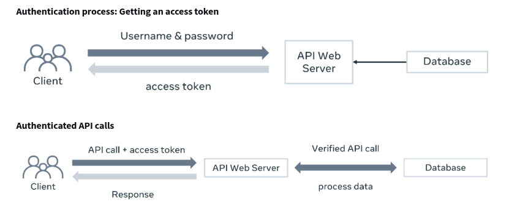

--> the different between authentication and authorization is that the first is what gives u the access in the first places and the second is what u can do after.

--> u should make roles and assigned it to users ; role is the set of privileges the user can do.

--> make API authentication done using tokens instead of the username password

--> a user can have multiple roles so any change of the roles privileges get updated to the users

--> if the user can't be authenticated the error is 401 unauthorized
--> if the user is authenticated and don't have the proper authorizations the error is 403 forbidden

# AUTHENTICATION

- the authentication is  done as follow the user should provide its username and password then the server-side verify this credentials id it match a existing user the server set an access token to the session and store it in the cookies of the user when the user try to access the side again the browser will add this cookies to the headers
# AUTHORIZATION

- the authorization is when the user is try to access some api the server check the token and extract the user info then it checks if the user have the right privileges to performs this action
