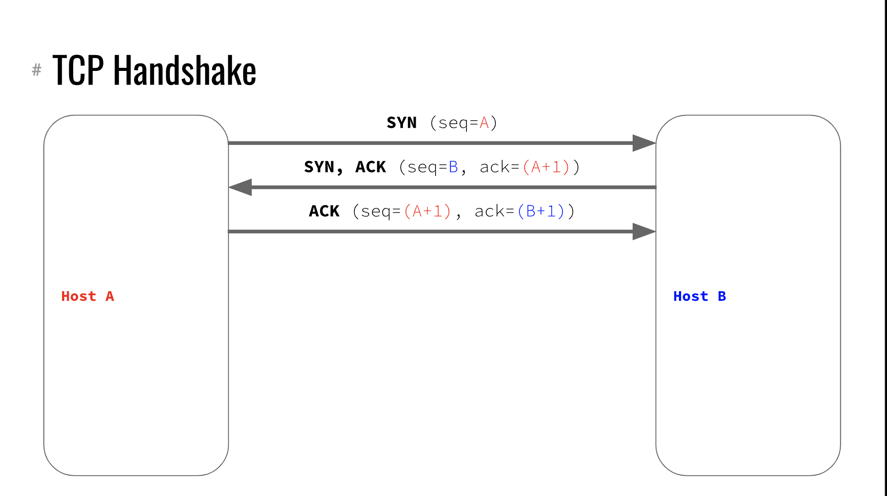

- this is the tcp handshake theory:



- this is my implementation 
```python
from scapy.all import TCP, IP, send, sniff

  

ip = IP(dst="10.0.0.2")

tcp = TCP(sport=31337, dport=31337, seq=31337 , flags="S")

packet = ip / tcp

send(packet)

def handle_packet(pckt):

	if pckt.haslayer("TCP"):

		print("recv TCP seq", pckt["TCP"].seq)

		print("recv TCP ack", pckt["TCP"].ack)

		print("recv---> ", pckt.summary())

		seq = pckt["TCP"].ack

		ack = pckt["TCP"].seq + 1

		print("send TCP seq", pckt["TCP"].seq)

		print("send TCP ack", pckt["TCP"].ack)

		tcp = TCP(sport=31337, dport=31337, seq=seq, ack=ack, flags="A")

		packet = ip / tcp

		send(packet)

  
  

sniff(count=10, filter="ip host 10.0.0.2", prn=handle_packet)
```
